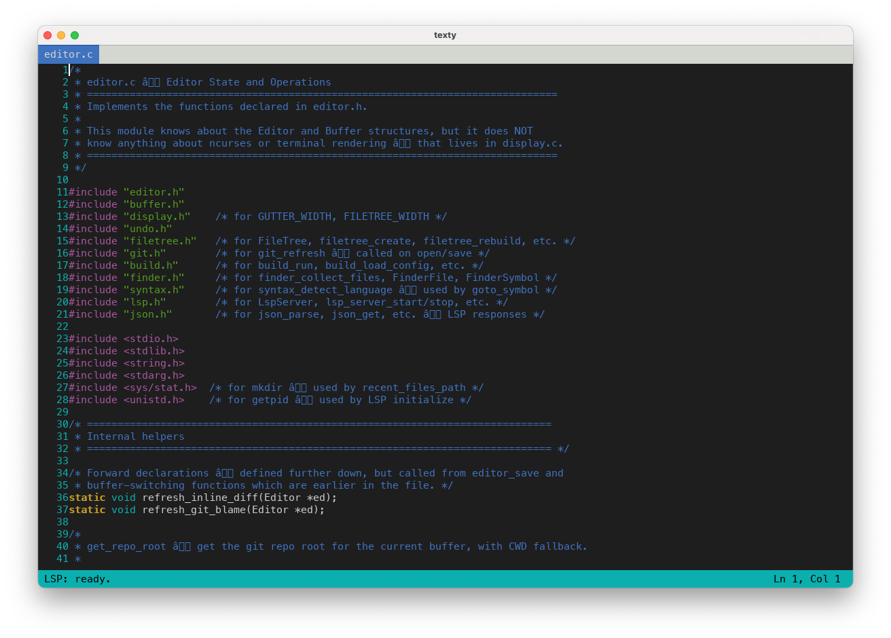

# texty

A terminal-based IDE written in C, built from scratch. Runs in the terminal (ncurses) or as a native GUI window (SDL2).



## Features

### Editor
- Open and edit files from the command line
- Undo / redo with per-buffer history
- Visual selection, copy, cut, paste
- Multiple open buffers with a tab bar
- Search and replace
- Auto-indent, tab→spaces, auto-close brackets/quotes
- Bracket matching highlight
- Show/hide whitespace, word wrap toggle
- Syntax highlighting for C, C++, Python, JS/TS, Rust, Go, JSON, Markdown, Shell, Makefile
- Region highlight — mark lines with a visible box border

### File Management
- File explorer panel — browse, open, create, rename, delete files
- Fuzzy file finder (Ctrl+P) — type to filter, scored matching
- Recent files (Ctrl+E) — persisted across sessions

### Navigation
- Go-to-symbol in file (F7) — functions, structs, classes, defines
- Go-to-symbol across project (Ctrl+T)
- Command palette (F8) — searchable list of all commands
- Jump to line (Ctrl+G)

### Git Integration
- Gutter markers — colored +/~/_ for added, modified, deleted lines
- Git status panel (F9) — list changed files, stage with 's'
- Git blame (Shift+F9) — per-line author and date annotations
- Inline diff view (F10) — see old lines from HEAD inline
- Stage hunks (F11) — stage individual diff hunks
- Commit (F12) — prompt for message, commit staged changes

### Build System
- Run build command (F5) — defaults to `make`
- Parse gcc/clang errors into a bottom panel
- Jump to error location (Enter on error)
- Configurable via `texty.json`

### Language Server Protocol (LSP)
- Automatic server start for configured languages (clangd, pylsp, rust-analyzer, etc.)
- Inline diagnostics — E/W markers in the gutter, messages in the status bar
- Auto-completion (Ctrl+Space) — popup with fuzzy-filtered results
- Go-to-definition (F1) — jump to symbol definition across files
- Hover documentation (Ctrl+K) — show type info and docs for symbol under cursor
- Find all references (via command palette) — list all usages, Enter to jump
- Code formatting (via command palette) — format document using the language server
- Rename symbol (via command palette) — rename across all files in the workspace
- Signature help (via command palette) — show function parameter info
- Configure in `texty.json`: `{"lsp_servers": {"c": "clangd"}}`

### Themes
- 4 built-in themes: Default Dark, Default Light, Monokai, Gruvbox Dark
- Cycle themes with F6
- Custom themes from `~/.config/texty/themes/*.theme`
- Theme background color support
- Set preferred theme in `texty.json`: `{"theme": "Gruvbox Dark"}`

## Requirements

- macOS, Linux, or Windows
- ncurses (`libncurses-dev` on Debian/Ubuntu, `ncurses-devel` on Fedora)
- **Optional (for GUI mode):** SDL2 + SDL2\_ttf (`brew install sdl2 sdl2_ttf` on macOS, `sudo apt install libsdl2-dev libsdl2-ttf-dev` on Linux)

## Build

```sh
make
```

Produces the `./texty` binary. If SDL2 and SDL2\_ttf are installed, GUI support is compiled in automatically.

## Usage

```sh
./texty [filename]       # terminal UI (ncurses)
./texty -G [filename]    # graphical UI (SDL2 window)
```

## Configuration

Create a `texty.json` in your project root:

```json
{
    "build_command": "make -j4",
    "theme": "Gruvbox Dark"
}
```

## Key bindings

### Cursor movement

| Key              | Action                      |
|------------------|-----------------------------|
| Arrow keys       | Move cursor                 |
| Home / End       | Start / end of line         |
| Page Up / Down   | Scroll one screen           |
| Ctrl+Home        | Jump to top of file         |
| Ctrl+End         | Jump to bottom of file      |

### Editing

| Key              | Action                               |
|------------------|--------------------------------------|
| Backspace        | Delete character before cursor       |
| Delete           | Delete character at cursor           |
| Enter            | Insert newline (auto-indents)        |
| Tab              | Insert 4 spaces                      |
| `(` `[` `{`      | Auto-insert closing bracket          |
| `"` `'`          | Auto-insert closing quote            |
| Ctrl+G           | Jump to line number                  |
| Ctrl+Z           | Undo                                 |
| Ctrl+Y           | Redo                                 |

### Selection & clipboard

| Key              | Action                               |
|------------------|--------------------------------------|
| Shift+Arrow      | Extend selection                     |
| Ctrl+A           | Select all                           |
| Ctrl+C           | Copy                                 |
| Ctrl+X           | Cut                                  |
| Ctrl+V           | Paste                                |

### Buffers

| Key              | Action                               |
|------------------|--------------------------------------|
| Ctrl+N           | New empty buffer                     |
| Ctrl+O           | Open file                            |
| Ctrl+W           | Close buffer                         |
| Ctrl+]           | Next buffer                          |
| Ctrl+\           | Previous buffer                      |

### Search

| Key              | Action                               |
|------------------|--------------------------------------|
| Ctrl+F           | Find                                 |
| F3               | Find next                            |
| Shift+F3         | Find previous                        |
| Ctrl+R           | Replace all                          |
| Escape           | Clear search highlights              |

### LSP

| Key              | Action                               |
|------------------|--------------------------------------|
| Ctrl+Space       | Auto-completion                      |
| F1               | Go to definition                     |
| Ctrl+K           | Hover documentation                  |

> **Note:** Find references, format document, rename symbol, and signature help
> are available through the command palette (F8). LSP requires a language server
> to be configured in `texty.json`.

### Navigation & tools

| Key              | Action                                          |
|------------------|-------------------------------------------------|
| Ctrl+P           | Fuzzy file finder                               |
| Ctrl+E           | Recent files                                    |
| Ctrl+T           | Go to symbol in workspace                       |
| F5               | Build                                           |
| F6               | Cycle color theme                               |
| F7               | Go to symbol in file                            |
| F8               | Command palette                                 |

### View

| Key              | Action                               |
|------------------|--------------------------------------|
| F2               | Toggle whitespace                    |
| F4               | Toggle word wrap                     |
| Ctrl+U           | Mark/clear region highlight          |
| Ctrl+B           | Toggle file explorer                 |

### Git

| Key              | Action                               |
|------------------|--------------------------------------|
| F9               | Git status panel                     |
| Shift+F9         | Git blame                            |
| F10              | Inline diff view                     |
| F11              | Stage hunk at cursor                 |
| F12              | Commit staged changes                |

### Panel navigation

All panels (file explorer, git status, build output):

| Key              | Action                               |
|------------------|--------------------------------------|
| Up / Down        | Navigate entries                     |
| Enter            | Open / jump to selection             |
| Escape           | Return focus to editor               |
| Ctrl+W           | Close the panel                      |

Git status panel also supports: `s` to stage the highlighted file.

### File

| Key              | Action                               |
|------------------|--------------------------------------|
| Ctrl+S           | Save                                 |
| Ctrl+Q           | Quit                                 |

## Custom themes

Create `.theme` files in `~/.config/texty/themes/`:

```
name = My Custom Theme

# Terminal background/foreground
default_fg = white
default_bg = black

# Syntax colors (color names: black red green yellow blue magenta cyan white, or -1 for default)
syn_keyword = yellow -1
syn_type = cyan -1
syn_string = green -1
syn_comment = blue -1
syn_preproc = magenta -1
syn_number = red -1

# UI elements
gutter = cyan -1
status = black cyan
status_dirty = black yellow
selection = black cyan
tab_active = white blue
tab_inactive = black white
search_match = black yellow
search_cur = black green
bracket = white magenta

# Bold attributes (1 = bold, 0 = normal)
syn_keyword_bold = 1
```

## Project structure

```
src/
  main.c        — Entry point and event loop
  buffer.h/c    — Text buffer (array of lines)
  editor.h/c    — Editor state, cursor movement, text operations
  display.h/c   — ncurses terminal rendering
  gui.h/c       — SDL2 graphical frontend (./texty -G)
  input.h/c     — Keyboard input dispatch
  undo.h/c      — Undo / redo stack
  syntax.h/c    — Syntax highlighting
  filetree.h/c  — File explorer tree logic
  git.h/c       — Git integration (gutter, blame, diff, staging, commit)
  build.h/c     — Build system (run command, parse errors, config)
  finder.h/c    — Fuzzy file finder (directory walk, scoring, filtering)
  theme.h/c     — Color theme support (built-in themes, parsing, cycling)
  json.h/c      — Minimal JSON parser (for LSP protocol)
  lsp.h/c       — LSP client (process management, message framing, protocol)
tests/
  test_runner.h — Minimal test framework
  test_buffer.c, test_editor.c, test_undo.c, test_syntax.c,
  test_filetree.c, test_git.c, test_build.c, test_finder.c,
  test_theme.c  — 663 unit tests
  display_stub.c — ncurses stubs for testing
Makefile        — Build system (make, make test, make test-debug)
TODO.md         — Phased development roadmap
```
